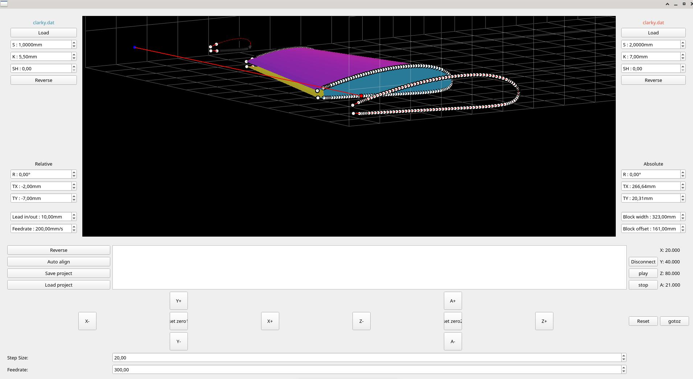

# Pywing_wifi

[](https://pywing.readthedocs.io/en/latest/?badge=latest)





From the excellent software found at https://github.com/proto3/grbl/tree/hotwire, through a series of ChatGPT-guided attempts, I managed to enhance this remarkable foundation to enable its integration with an ESP32 running Grbl (FluidNc). This setup allows for managing the XY axes of the first arm and the ZA axis of the second arm via Telnet connection to 192.168.0.1. Additionally, I added jog controls for positioning the arms and a work zero setting feature. I also implemented real-time tracking on the 3D visualization window.

This is an initial draft that suits my needs, but it would be beneficial to have the ability to select either the serial port or Telnet connection. In this fork version, I simply repurposed the serial port thread. There is still much work to be done, and I am unfamiliar with Python, but I believe this could be of interest to others.

 the rest is the original docs.
Pywing is a all-in-one software for hot wire foam CNC cutting. It can generate G-Code for other softwares or directly communicate with a 4-axis(XYUV) Grbl through serial link (see https://github.com/proto3/grbl/tree/hotwire).

It has no drop down menus, so everything you need is visible. Just try scrolling on each field and you will see instantly what it does in the 3D view.

## How to use it ?

First of all, clone the repository and open a terminal inside pywing folder.

Follow this instructions to create a virtualenv and install required packages inside it (or just install packages in requirements.txt with the package manager you're used to):
```shell
# install virtualenv (use your dist packages manager if not apt)
sudo apt-get install virtualenv

# create a python3 virtualenv inside pywing folder
virtualenv -p python3 env

# activate your virtualenv
source env/bin/activate

# install pywing dependencies inside it
pip install -r requirements.txt

# run pywing
./pywing.py

# deactivate your virtualenv
deactivate
```
